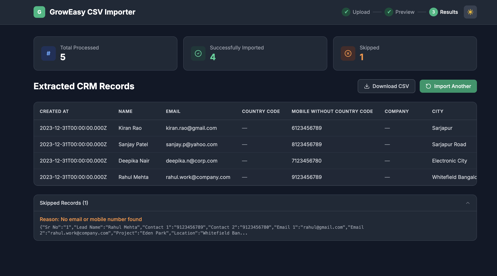

# GrowEasy AI-Powered CSV Importer

An intelligent CSV importer that uses AI (Groq/OpenAI/Gemini) to extract and map CRM lead information from any CSV format into GrowEasy CRM format.

🔗 **Live Demo:** [https://groweasy-csv-importer-five.vercel.app](https://groweasy-csv-importer-five.vercel.app)


## Screenshots

### AI-Extracted CRM Results (Real Estate CSV)


## Features

- **Smart AI Field Mapping** — Intelligently maps any CSV column structure to CRM fields
- **Drag & Drop Upload** — Beautiful drag-and-drop file upload experience
- **Data Preview** — Preview uploaded data before processing with scrollable, responsive tables
- **Batch Processing** — Handles large CSVs by processing records in batches of 20
- **Retry Mechanism** — Automatic retries with exponential backoff for failed AI batches
- **Progress Indicators** — Real-time progress during AI processing
- **Dark Mode** — Full dark mode support
- **CSV Export** — Download extracted CRM records as CSV
- **Error Handling** — Graceful handling of invalid records and AI failures
- **Multiple AI Providers** — Supports Groq (free), OpenAI, and Google Gemini

## Supported CSV Formats

The AI intelligently maps columns from any source:

- Facebook Lead Exports
- Google Ads Exports
- Excel Spreadsheets
- Real Estate CRM Exports
- Sales Reports
- Marketing Agency CSVs
- Custom/Manual Spreadsheets

## Tech Stack

| Layer    | Technology                        |
| -------- | --------------------------------- |
| Frontend | Next.js 14, TypeScript, Tailwind CSS v3, TanStack Table |
| Backend  | Node.js, Express, Multer, csv-parse |
| AI       | Groq (Llama 3.3 70B) / OpenAI / Google Gemini |
| DevOps   | Docker, Docker Compose            |

## Quick Start

### Prerequisites

- Node.js 18+
- npm
- An API key for [Groq](https://console.groq.com/keys) (free, no credit card needed), [Google Gemini](https://aistudio.google.com/apikey), or [OpenAI](https://platform.openai.com/api-keys)

### 1. Clone the Repository

```bash
git clone https://github.com/YOUR_USERNAME/groweasy-csv-importer.git
cd groweasy-csv-importer
```

### 2. Set Up the Backend

```bash
cd backend
npm install

# Create environment file
cp .env.example .env
```

Edit `.env` and add your API key:

```env
AI_PROVIDER=groq             # or "openai" or "gemini"
GROQ_API_KEY=your_key        # if using Groq (recommended, free)
OPENAI_API_KEY=your_key      # if using OpenAI
GEMINI_API_KEY=your_key      # if using Gemini
PORT=3001
```

Start the backend:

```bash
npm run dev
```

### 3. Set Up the Frontend

```bash
cd frontend
npm install

# Create environment file (optional, defaults to localhost:3001)
cp .env.example .env.local
```

Start the frontend:

```bash
npm run dev
```

### 4. Open the Application

Visit [http://localhost:3000](http://localhost:3000) in your browser.

## Docker Setup

### Using Docker Compose

```bash
# Copy environment file and add your API keys
cp .env.example .env

# Build and run
docker compose up --build
```

The application will be available at:
- Frontend: http://localhost:3000
- Backend: http://localhost:3001

## API Documentation

### `POST /api/upload`

Upload and parse a CSV file.

**Request:** `multipart/form-data` with field `file`

**Response:**
```json
{
  "success": true,
  "filename": "leads.csv",
  "totalRecords": 50,
  "headers": ["Name", "Email", "Phone", ...],
  "preview": [...],
  "allRecords": [...]
}
```

### `POST /api/process`

Process records through AI extraction.

**Request:**
```json
{
  "records": [...],
  "headers": ["Name", "Email", "Phone", ...]
}
```

**Response:**
```json
{
  "success": true,
  "data": {
    "extracted": [...],
    "skipped": [...],
    "summary": {
      "totalProcessed": 50,
      "totalImported": 47,
      "totalSkipped": 3
    },
    "crmFields": [...]
  }
}
```

### `GET /api/health`

Health check endpoint.

## CRM Fields

| Field | Description |
|-------|-------------|
| created_at | Lead creation date |
| name | Lead name |
| email | Primary email |
| country_code | Country code (e.g., +91) |
| mobile_without_country_code | Mobile number |
| company | Company name |
| city | City |
| state | State |
| country | Country |
| lead_owner | Lead owner |
| crm_status | GOOD_LEAD_FOLLOW_UP / DID_NOT_CONNECT / BAD_LEAD / SALE_DONE |
| crm_note | Notes, extra emails/phones |
| data_source | leads_on_demand / meridian_tower / eden_park / varah_swamy / sarjapur_plots |
| possession_time | Property possession time |
| description | Additional description |

## Project Structure

```
groweasy-csv-importer/
├── backend/
│   ├── src/
│   │   ├── controllers/
│   │   │   └── uploadController.js
│   │   ├── middleware/
│   │   │   └── upload.js
│   │   ├── routes/
│   │   │   └── upload.js
│   │   ├── services/
│   │   │   ├── aiExtractor.js
│   │   │   ├── aiProviders.js
│   │   │   └── csvParser.js
│   │   └── index.js
│   ├── .env.example
│   ├── Dockerfile
│   └── package.json
├── frontend/
│   ├── src/
│   │   ├── app/
│   │   │   ├── globals.css
│   │   │   ├── layout.tsx
│   │   │   └── page.tsx
│   │   ├── components/
│   │   │   ├── UploadStep.tsx
│   │   │   ├── PreviewStep.tsx
│   │   │   └── ResultsStep.tsx
│   │   └── types/
│   │       └── index.ts
│   ├── .env.example
│   ├── Dockerfile
│   └── package.json
├── docker-compose.yml
├── .env.example
└── README.md
```

## Design Decisions

1. **Stateless Architecture** — No database required. CSV data is processed in-memory and returned immediately.
2. **Batch Processing** — Records are sent to AI in batches of 20 to avoid token limits and improve reliability.
3. **Retry with Backoff** — Failed AI batches are retried up to 3 times with exponential backoff.
4. **Provider Abstraction** — AI provider is abstracted so switching between OpenAI and Gemini requires only a config change.
5. **Memory Upload** — Files are stored in memory (not disk) for faster processing and simpler cleanup.

## License

MIT
